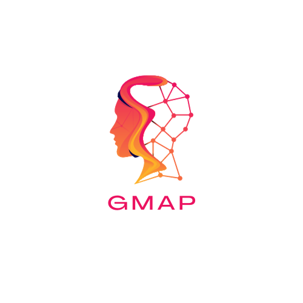

# GMAP Web Application



## Overview

This repository contains the code for the GMAP (Grupo de Maratonistas de Programacion) web application. The project is built with Next.js 14 using Typescript, Tailwind CSS, and PostgreSQL.

## Technologies Used

- [Next.js](https://nextjs.org/) 14
- [Typescript](https://www.typescriptlang.org/)
- [Tailwind CSS](https://tailwindcss.com/)
- [PostgreSQL](https://www.postgresql.org/)

## Features

- Feature 1
- Feature 2
- Feature 3

## Getting Started

### Prerequisites

- Node.js (version x.x.x)
- npm or yarn
- PostgreSQL

### Installation

1. Clone the repository:

   ```bash
   git clone https://github.com/your-username/gmap-web-app.git
   ```
